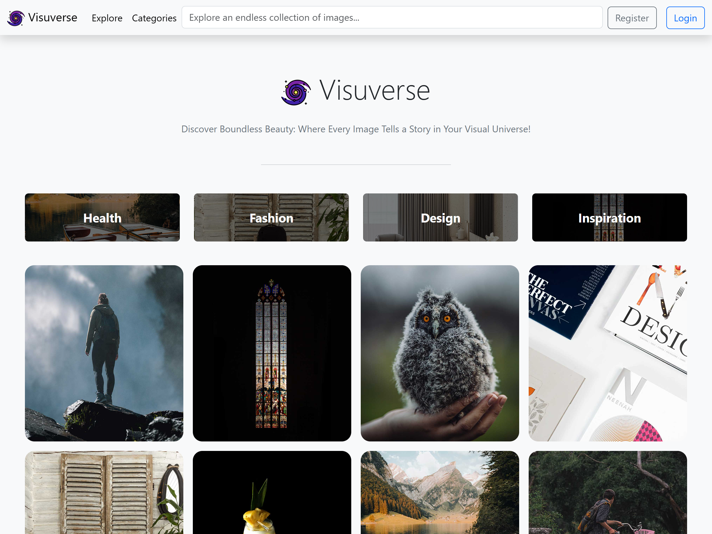

## Visuverse

Website Visuverse merupakan hasil pengembangan saya sendiri dengan menggunakan Laravel sebagai backend (Restful API) dan Vue sebagai frontend. Konseptual Visuverse merupakan perpaduan antara konsep "visual" dan "universe" yang menggambarkan ruang visual yang luas di mana berbagai jenis gambar dapat dijelajahi. Visuverse adalah sebuah platform pinboard virtual yang memungkinkan pengguna untuk mengunggah serta mengatur foto atau gambar dalam kategori-kategori yang dapat disesuaikan sesuai keinginan. Sebagai contoh, kategori "food and drink" menyajikan koleksi gambar tentang makanan dan minuman.

